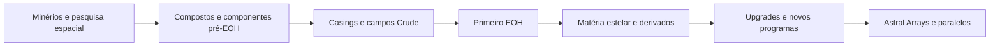

# Eye of Harmony — auditoria de fabricação, materiais e planetas

Data: 06/10/2026. Destino: GTNA / Minecraft 1.20.1 / GTCEu 7.5.3.
Escopo original: auditoria e propostas. Em 2026-10-07, foi acrescentada uma rota
adaptada de 32 receitas de construção na Assembly Line (três casings, 27 campos,
controlador e planeta Overworld). Ela usa componentes GTCEu pré-EOH e pesquisa;
não implementa a rede BEC nem a cadeia completa de materiais GTNH. A auditoria
abaixo continua sendo a referência para as lacunas da progressão fiel.

## Resultado e recomendação

O EOH funcional já existe, mas sua fabricação não forma uma progressão Survival completa.
Não basta acrescentar a receita do controlador: faltam aquisição/processamento dos materiais,
receitas dos campos e casings próprios, seletores fabricáveis e programas planetários adicionais.

Recomendo uma **progressão adaptada em duas etapas**: primeiro uma cadeia independente para
fabricar um EOH Crude; depois materiais estelares e upgrades até Gallifreyan. Preserve materiais
que representam funções distintas; substitua dependências de mods antigos por componentes
modernos de função equivalente. Uma rota integral BEC é possível, mas constitui outro projeto
substancial de máquinas, logística e progressão, além do EOH.

Não recomendo transformar SpaceTime, matérias de anãs ou Universium em minérios planetários.
São produtos de síntese/transformação endgame. Planetas fornecem matéria-prima e amostras de
pesquisa; as máquinas produzem os materiais especiais.

## Evidência e limites

Referência GTNH congelada: `a3e1e11241a814c9fa0dd0973d5699548428f689`, conforme roadmap anterior.
Esta é uma revisão de código, não uma versão de modpack identificada.

| Fonte verificada | O que demonstra |
|---|---|
| [ResearchStationAssemblyLine](https://github.com/GTNewHorizons/GT5-Unofficial/blob/a3e1e11241a814c9fa0dd0973d5699548428f689/src/main/java/tectech/loader/recipe/ResearchStationAssemblyLine.java#L151) | Receita e pesquisa do controlador |
| [BECRecipes](https://github.com/GTNewHorizons/GT5-Unofficial/blob/a3e1e11241a814c9fa0dd0973d5699548428f689/src/main/java/gregtech/loaders/postload/recipes/BECRecipes.java#L434) | Três casings, 27 campos, Astral Array e arrays dos nove tiers |
| [BECMetaMaterialRecipes](https://github.com/GTNewHorizons/GT5-Unofficial/blob/a3e1e11241a814c9fa0dd0973d5699548428f689/src/main/java/gregtech/loaders/postload/recipes/BECMetaMaterialRecipes.java) | Oito famílias de metamateriais, com três/quatro variantes |
| [CondensateType](https://github.com/GTNewHorizons/GT5-Unofficial/blob/a3e1e11241a814c9fa0dd0973d5699548428f689/src/main/java/gregtech/api/enums/CondensateType.java) | Condensados entangled pertencem à rede BEC; não são fluidos normais de mixer |
| [NaniteTier](https://github.com/GTNewHorizons/GT5-Unofficial/blob/a3e1e11241a814c9fa0dd0973d5699548428f689/src/main/java/gregtech/api/enums/NaniteTier.java) | Tipos e tiers de nanites |
| [EyeOfHarmonyRecipeStorage](https://github.com/GTNewHorizons/GT5-Unofficial/blob/a3e1e11241a814c9fa0dd0973d5699548428f689/src/main/java/tectech/recipe/EyeOfHarmonyRecipeStorage.java) | Catálogo original derivado dos minérios das dimensões |
| [MTEBECAssembler](https://github.com/GTNewHorizons/GT5-Unofficial/blob/a3e1e11241a814c9fa0dd0973d5699548428f689/src/main/java/tectech/thing/metaTileEntity/multi/bec/MTEBECAssembler.java) / [MTEBECGenerator](https://github.com/GTNewHorizons/GT5-Unofficial/blob/a3e1e11241a814c9fa0dd0973d5699548428f689/src/main/java/tectech/thing/metaTileEntity/multi/bec/MTEBECGenerator.java) | Rede especializada, nanite hatches, energia e geração de condensados |

Fontes locais conferidas: GTCEu `91a79b8a7a2b62ec6277423e6c0ded4af89a831e`,
GTLCore `18c781404aa5a406837b3492ca1afa428458e751`, GTOCore
`dc4824d1608ffad3bb0e2d53a2a068a739da3e84`, GTNL
`52345d2c059c871febec1365d6012424c7d64547`. GTLCore serve como candidato de adaptação
moderna; seus materiais e assets não provam que a cadeia GTNH esteja portada ou acessível.

O [inventário JSON](eye-of-harmony-progression-inventory.json) extrai dependências materiais
simbólicas diretas e do loader de metamateriais, testa declaração em GTMaterials/GTNAMaterials
e registra hashes das fontes lidas. Presença não prova aquisição. Não é um fechamento recursivo
de todas as receitas de todos os mods GTNH. GoodGenerator, GT++, singularidades e Godforge
precisam de auditoria própria se a opção escolhida for fidelidade integral.

## O que o GTNA já possui

| Conteúdo | Estado verificado | Trabalho restante |
|---|---|---|
| Controlador e estrutura | Operação e estrutura implementadas | Receita de fabricação e pesquisa |
| Campos | 3 famílias × 9 tiers registrados | 27 receitas e cadeia de ingredientes |
| Casings espacial, temporal e boundary | Registrados | Receitas próprias |
| Casings externos/injection existentes | Receitas adaptadas em GTNABlockRecipes | Avaliar custo conjunto; não duplicar esses registros |
| SpaceTime, White/Black Dwarf Matter, Universium | Metais registrados, formas estruturais, sem autogen de receitas | Aquisição, solidificação e conformação explícitas |
| RawStarMatter, Time, Space | Fluidos registrados | Cadeias de produção e usos; RawStarMatter é líquido, apesar do nome plasma |
| Programa Overworld | Produtos calculados com veias GTCEu; inclui mistura estelar e matéria de anã branca | Integrar produtos à progressão de upgrades |
| SpaceTime | Saída de falha do ciclo atual | Fonte anterior ao primeiro EOH se exigido em sua construção |
| Nether/End Planet Blocks | Registrados | Fabricação e programas operacionais; o controller atual só aceita Overworld |
| Astral Array Fabricator | Item registrado | Fabricação e mecânica de paralelos; não só a receita |
| Planet Data Chips | Scanner e programas Void Miner Ad Astra existentes | Reaproveitar descoberta; conectar a novos seletores/programas EOH |
| Rede Nexus / Star | Geração, terminais e armazenamento implementados | Medir custo de aquisição junto dos ciclos do EOH |

Arquivos de destino principais: `common/data/GTNAEyeOfHarmonyContent.java`,
`common/data/material/EyeOfHarmonyMaterials.java`, `common/data/multiblock/EyeOfHarmonyOverworld.java`,
`common/machine/multiblock/noenergy/EyeOfHarmonyMachine.java`, `data/recipe/GTNABlockRecipes.java`,
`data/recipe/GTNAItemRecipes.java` e `data/recipe/GTNAMachineRecipes.java`.

**Atenção aos nomes:** Cosmic Neutronium/Infinity Antimatter Fuel Rod são itens existentes,
mas suas receitas usam materiais GTCEu, incluindo Neutronium. Isso não significa que os metais
Cosmic Neutronium e Infinity existam no GTNA.

## Dependências da rota original

O controlador exige, entre outros, Space Elevators, Godforges, Plasma Forges, computadores,
aceleradores, armazenamento quântico, void miners/drillers, componentes UMV e supercondutor
UMV; consome Time, Space, Metastable Oganesson e Shirabon. Tem pesquisa e fabricação distintas.

BEC acrescenta condensados, nanites por slot, metamateriais e componentes externos. Os nove
materiais diferenciadores de campos são Netherite, Proto-Halkonite, Six-Phased Copper,
Transcendent Metal, Mellion, Creon, SpaceTime, Hexanite e Eternity. Seus tempos não crescem
monotonicamente; copiar a sequência sem a lógica de velocidade BEC produziria outro equilíbrio.

| Grupo | Decisão para um port fiel | Alternativa adaptada proposta |
|---|---|---|
| Godforge e módulos | Portar funcionamento, construção, pesquisa e cadeias | Síntese estelar especializada, com custos próprios; não chamar de Godforge fiel |
| Plasma Forge | Portar controlador, estrutura e processamento | Linha de fusão/plasma GTCEu e máquina avançada, validando produtos alcançáveis |
| Space Elevator | Portar acesso/logística e componentes | Pesquisa com dados planetários reais do Scanner + componentes espaciais próprios |
| Computador/accelerator/quantum chest | Mapear tecnologia e tier, não só nome | Computação/pesquisa GTCEu, sensor/emitter e Quantum Chest já disponível |
| Void Miner / Fluid Drill | Conferir diferenças da origem | Aproveitar máquinas GTNA existentes; registro similar não garante equivalência de produção |
| Singularidades AE2/Avaritia/AE2 Fluid Craft | Recriar aquisição e compatibilidade | AE2 singularity quando disponível + item próprio para singularidade de fluido |
| Energised Tesseract, ZPM5, circuitos de fluxo, componentes solares RGB | Cadeias externas ausentes | Células de energia, controladores de fluxo e emissores especializados com receitas reais |
| Supercondutores UHV–UMV | Portar ligas, fios, solenoides e formas | Usar supercondutores modernos existentes nos primeiros tiers; compostos novos nos últimos |
| Oito famílias de metamateriais | Portar Shielding, Waveguide, Energy Conduit, Electrogravitic Valve, Wave Focus, Resonance Chamber, Sensor Array, Field Manipulator | Componentes de função correspondente, mantendo quatro etapas de evolução |
| Nanites | Produção, formas, contenção e regras de aplicação | Catalisadores/nanites com máquina própria; definir se são consumidos ou ferramenta, sem assumir equivalência |
| Condensados BEC | Generator, Assembler, I/O nodes, storage, diode, pipes e rede | Fluidos/catalisadores estabilizados de uma progressão declaradamente adaptada |

O GTCEu 7.5.3 local não declara os prefixes `nanite` e `plateSuperdense` do original.
Não usar stacks vazios: criar formas próprias ou substituir superdense por um componente de
compactação equivalente, com conservação de massa/custo explicitamente calculada.

## Os nove estágios de campo

A mesma escala material aparece nas três famílias. Os nomes de campo já existem no GTNA;
os nomes alternativos abaixo são opções de apresentação, sem alterar IDs ou tier interno.

| Tier interno / mostrado | Nome atual | Material original diferenciador | Prioridade adaptada |
|---|---|---|---|
| 0 / 1 | Crude | Netherite | Primeira construção; conferir gear/dense plate/long rod além do ingot vanilla |
| 1 / 2 | Primitive | Proto-Halkonite | Composto de contenção independente do EOH |
| 2 / 3 | Stable | Six-Phased Copper | Condução hexafásica após operação inicial |
| 3 / 4 | Advanced | Transcendent Metal | Liga transcendente e novo estágio de pesquisa |
| 4 / 5 | Superb | Mellion | Liga gravítica proposta |
| 5 / 6 | Exotic | Creon | Liga cronométrica proposta |
| 6 / 7 | Perfect | SpaceTime | Síntese/produção EOH e conformação explícita |
| 7 / 8 | Tipler | Hexanite | Contenção final; conservar nome se fiel |
| 8 / 9 | Gallifreyan | Eternity | Liga final e etapa anterior aos Astral Arrays |

Na rota BEC, somente trocar o material diferenciador não reproduz a dificuldade: nanites,
metamateriais, condensados e quantidades também mudam. Tipler/Gallifreyan podem receber nomes
alternativos “Causal / Causal” e “Transcendent / Transcendente” na apresentação de um perfil
próprio; preservá-los mantém melhor a referência GTNH. Nenhuma renomeação foi aplicada.

## Materiais: portar, substituir e nomear

Os sete materiais centrais já possuem IDs persistidos. Preserve esses IDs. Alterar o nome exibido
em lang é diferente de substituir uma identidade material numa receita. Não use “Ingot”/“Lingote”
no nome-base: o prefixo deve formar Lingote/Placa/Parafuso de X sem duplicar palavras.

| Original / função | Sugestão de nome exibido EN / PT | Recomendação |
|---|---|---|
| SpaceTime / estrutura espaço-temporal | Spacetime Matter / Matéria Espaço-Temporal | Manter `space_time`; não substituir por liga comum |
| White Dwarf Matter / matéria degenerada | White Dwarf Matter / Matéria de Anã Branca | Manter identidade e ID; fonte EOH pós-construção |
| Black Dwarf Matter / evolução estelar | Black Dwarf Matter / Matéria de Anã Negra | Manter; cadeia posterior à anã branca é proposta, não receita já existente |
| Universium / matéria final | Universium / Universium | Manter; evitar chamar de minério |
| RawStarMatter / mistura estelar | Condensed Stellar Matter / Matéria Estelar Condensada | Nome alternativo; preservar `raw_star_matter` e estado líquido |
| Time / fluido temporal | Tachyon-Rich Temporal Fluid / Fluido Temporal Rico em Táquions | Manter `temporal_fluid` |
| Space / fluido espacial | Spatially Expanded Fluid / Fluido Espacial Expandido | Manter `spatial_fluid` |
| Cosmic Neutronium / liga ultradensa | Cosmic Neutronium / Neutrônio Cósmico | Port seletivo com cadeia própria; Neutronium comum pode ser precursor |
| Infinity / estrutura final | Infinity Alloy / Liga do Infinito | Novo metal opcional; não confundir com fuel rod nem exigir Avaritia implicitamente |
| Transcendent Metal / condução dimensional | Transcendent Alloy / Liga Transcendente | Port seletivo; núcleo funcional dos upgrades |
| Six-Phased Copper / condução avançada | Six-Phase Copper / Cobre Hexafásico | Novo composto, não renomear Copper comum |
| Proto-Halkonite / estrutura inicial avançada | Proto-Halkonite / Proto-Halconita | Pode virar **novo** Composite de Contenção no perfil adaptado; não alegar mesmo material |
| Mellion / estágio intermediário | Gravitic Alloy / Liga Gravítica | Substituição de design proposta; um novo material de função definida |
| Creon / estágio intermediário superior | Chronometric Alloy / Liga Cronométrica | Substituição de design proposta, separada da liga gravítica |
| Hexanite / estrutura de alto tier | Hexanite / Hexanita | Manter ou novo composto de contenção de seis fases; não confundir com seis fases do cobre |
| Eternity / último tier | Eternity Alloy / Liga da Eternidade | Manter estágio final; pode ficar para a segunda entrega |
| Shirabon / ajuste dimensional | Resonant Dimensional Alloy / Liga Dimensional Ressonante | Substituição nova; auditar a receita original antes de alegar paridade |
| Metastable Oganesson / elemento estabilizado | Metastable Oganesson / Oganessônio Metaestável | Se fiel, registrar cadeia isotópica; Duranium/Tritanium só em receita adaptada inicial |
| Bedrockium / blindagem compactada | Compressed Bedrock Composite / Compósito de Bedrock Compactado | Item/compósito sintético, sem exigir extração de bedrock do mundo |
| Hypogen / matéria extrema | Hypogen / Hipógeno | Adiar junto da cadeia avançada; não necessário ao núcleo mínimo adaptado |
| Ledox / Callisto Ice / materiais planetários | Nomes próprios se portar suas origens | Preferir recursos de planetas disponíveis; não criar “gelo de Calisto” em Glacio como se fiel |
| Churitsu / Shijima / Tairitsu | Nomes próprios na rota fiel | Componentes de metamaterial distintos na rota adaptada; não três aliases do mesmo ingot |
| MHDCSM / MagMatter / QGP / solda cósmica e meios especiais | Manter identidade física/fictícia distinta | Dependências avançadas do BEC/Godforge; adiar na primeira cadeia adaptada |

Neutronium, Blue Topaz, Duranium, Tritanium, Naquadah Alloy e Rhodium-Plated Palladium
já têm declaração GTCEu. Isso não garante todas as formas exigidas: Blue Topaz é especialmente
um candidato a verificar antes de pedir plate/screw. Materiais com nomes novos precisam de
receita de aquisição; um nome diferente não corrige uma dependência indisponível.

**Conjunto novo sugerido para começar:** três compostos funcionais (contenção, condução
transcendente, ressonância), um catalisador de pesquisa espaço-temporal e componentes das
três famílias de campo. Usar Neutronium e supercondutores existentes como precursores.
Cosmic Neutronium, liga do Infinito, cobre hexafásico e Eternity entram após a primeira operação.
Esta redução é uma proposta de escopo, não uma equivalência numérica às receitas GTNH.

## Planetas e minérios

A mineração espacial GTNA já tem programas Ad Astra com estes produtos. São receitas de
Void Miner; não comprovam a existência de veias físicas nesses planetas nem de programa EOH.

| Destino existente | Produtos do Void Miner atual | Papel sugerido antes do EOH |
|---|---|---|
| Lua | Bauxite, Ilmenite | Estrutura leve, titânio e primeiro chip planetário |
| Marte | Scheelite, Tungstate, Cooperite | Tungstênio e grupo da platina; ressonadores |
| Vênus | Sulfur, Pyrite, Galena, Chromite | Reagentes, cromo e blindagem |
| Mercúrio | Garnierite, Nickel, Cobaltite | Ligas condutoras e magnéticas |
| Glacio | Bastnasite, Tungstate, Tantalite | Terras raras e tântalo; dispositivos avançados |

Reutilize os materiais existentes antes de importar dezenas de minérios. Portar minério novo
somente se tiver produto químico útil, processamento e função que não seja coberta por outro.
Ad Astra precisa ser opcional: omitir receitas/programas dependentes quando ausente e declarar
se a cadeia Survival adaptada precisa de uma alternativa terrestre mais cara.

Para veias reais: registrar host rocks/prefixes adequados e configuração de veia GTCEu,
altura, peso, densidade, dimensão e indicadores. O catálogo EOH precisa ler essas mesmas
fontes ou um catálogo explícito compartilhado com a mineração; não deduzir a abundância da
quantidade de uma receita de Void Miner. Veias novas só aparecerão em chunks novos, salvo
retrogen separado. Não adicionar retrogen automaticamente.

Nether/End vêm antes dos cinco planetas externos, mas exigem catálogos reais distintos. O
programa atual consulta `Level.OVERWORLD`; não basta trocar o ícone do planeta. Generalizar
filtro por dimensão e definir gates/custos/chance/rendimento por programa, além do viewer.
Mapeamento de tier de foguete GTNH para campo 0–8 deve ser explícito; não copiar tiers de
Ad Astra como se representassem a mesma dificuldade. Júpiter, Calisto e outros destinos GTNH
não justificam criar dimensões inteiras apenas para preencher uma lista de outputs.

## Como portar com uma cadeia fabricável

1. **Manifesto de receitas.** Por receita: origem/revisão, entradas e formas, quantidades,
   fluidos e unidade, pesquisa, duração, EU/t, saída e substituições. Diferenciar pesquisa
   do controller (computation e amperagem próprios) da energia/tempo de fabricação.
2. **Aquisição independente.** Construir um grafo desde recursos mineráveis e máquinas
   pré-EOH. Cada item/fluid precisa de uma fonte alcançável; tags/prefixes resolvem stacks
   reais. Validar modos/configurações suportados, não apenas o Creative.
3. **Materiais e processamento.** Registrar em GTNAMaterials e inicializador adequado;
   adicionar somente formas utilizadas. Para os metais especiais com autogen desativado,
   criar solidificação, conformação e reciclagem explícitas. Evitar mixer barato gerando
   matéria estelar/SpaceTime e evitar receitas de reciclagem que aumentem massa.
4. **Componentes e pesquisa.** Assembly Line moderna com `stationResearch`, pesquisa
   anterior alcançável e slots compatíveis. Onde mais de 16 entradas forem necessárias,
   submontagens próprias ou recipe type especializado; não omitir ingredientes.
5. **Construção Crude.** Controller + campos tier 0 + três casings próprios + seletor
   Overworld. Mantêm-se 896 casings externos, 534 injection, 138 compressão, 168 aceleração,
   48 estabilização e posições boundary/hatches conforme estrutura atual. Medir o custo
   de toda a estrutura, não só de um bloco. Não exigir Astral Array no primeiro EOH.
6. **Upgrades.** Produtos estelares alimentam materiais/campos superiores. Receita de
   estabilização deve manter seu papel próprio; exigir campos de compressão/aceleração
   equivalentes pode conservar a dependência original. Upgrades podem consumir o campo
   anterior no perfil adaptado, deixando explícito que a referência fabrica variantes.
7. **Planetas/paralelos.** Completar Nether/End, depois Ad Astra e finalmente Astral Arrays.
   Grandes quantidades permanecem long/BigInteger e são entregues em lotes. Não instanciar
   milhões de stacks nem reduzir quantidade para caber no int de uma receita comum.
8. **Arte e compatibilidade.** Lang EN/PT, modelos, tooltips de origem e pesquisa. Manter
   IDs existentes; nomes novos em lang não exigem migração. Verificar licença de código e
   assets separadamente; GTNASources/THIRD_PARTY_NOTICES para conteúdo realmente importado.
   Orientação segue NEXT-SESSION-HANDOFF, com controller externo e ordem vertical correta.

Para BEC integral, adicionar primeiro a rede de condensados e seus contratos de save/unload,
perdas, buffers, consumo e energia. A receita especial armazena requisitos de nanites por slot;
`notConsumable` genérico em toda entrada não reproduz esse sistema. A rede BEC e a rede de
energia Nexus têm responsabilidades distintas, mesmo se ambas estiverem ligadas por UUID.

## Risco principal: dependências circulares

No GTNA atual, a matéria de anã branca vem do EOH e SpaceTime pode vir de falhas dele. Exigir
qualquer um deles nos campos tier 0, controller ou pré-máquinas sem fonte independente trava
Survival. Isso é um risco da adaptação, não prova de um ciclo insolúvel na progressão completa GTNH.

A opção preferida é não exigir produtos exclusivos do EOH na construção Crude. Uma alternativa
é síntese pré-EOH lenta/cara de pequenas quantidades, seguida da produção em massa no EOH.
Se escolhida essa alternativa, precisa de máquina e receita explícitas, não loot de Creative.
Time/Space também precisam de fontes anteriores se permanecerem fluidos de construção.

## Ordem de entregas e critérios

| Entrega | Conteúdo mínimo | Critério de conclusão |
|---|---|---|
| A — primeiro EOH em Survival | Aquisição prévia, três casings, três campos Crude, controller, seletor Overworld | Construção alcançável sem qualquer output do EOH |
| B — tiers intermediários | Materiais estelares e três famílias até o estágio escolhido | Cada upgrade obtível; economia comparada com Star/void mining |
| C — exploração | Nether/End, chips, programas Ad Astra e veias necessárias | Catálogos reais, ausência de mods sem ingrediente vazio |
| D — final e paralelos | Últimos tiers e Astral Arrays | Save/reload, consumo e entregas grandes sem duplicação |
| Alternativa BEC | Máquina/rede/metamateriais/nanites e suas cadeias | Paridade funcional documentada antes de migrar receitas |

Testes necessários quando implementar: grafo de aquisição sem ciclos bloqueantes, stacks/tags
não vazios, formas disponíveis, receitas/pesquisas carregadas, fabricação em máquinas reais,
catálogos de cada dimensão e exatidão de quantidades. Comparar output de mineração com EOH;
energia/circuitos usam o rebalanceamento local `(k+1)^2`, não a regra antiga `4^k`.

Gate obrigatório: `./gradlew spotlessCheck compileJava runUnitTests runGameTestServer runData --offline`.
Conferência manual: jogar a cadeia Crude em Survival, nomes/EMI, obter amostras nos planetas e
avaliar se a construção inteira corresponde à dificuldade pretendida. Custos finais, escolha
BEC versus adaptada, nomes e fontes dos materiais novos permanecem propostas para o autor.
